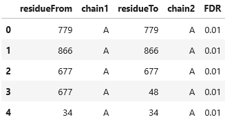

import { Callout } from 'nextra/components'

# Exporting Crosslinks to AlphaLink2


```python copy
from pyXLMS import __version__

print(f"Installed pyXLMS version: {__version__}")
```
<Callout emoji="✓">
```
    Installed pyXLMS version: 1.6.0
```
</Callout>


```python copy
from pyXLMS import parser
from pyXLMS import exporter
```

All exporting functionality is available via the `exporter` submodule. We also import the `parser` submodule to read crosslinks.


```python copy
parser_result = parser.read(
    "../../data/ms_annika/XLpeplib_Beveridge_QEx-HFX_DSS_R1_Crosslinks.xlsx",
    engine="MS Annika",
    crosslinker="DSS",
)
xls = parser_result["crosslinks"]
```
<Callout emoji="✓">
```
    Reading MS Annika crosslinks...: 100%|██████████████████████████████████████████████████████████████████████████| 300/300 [00:00<00:00, 19063.00it/s]
```
</Callout>

We read crosslinks using the [generic parser](https://hgb-bin-proteomics.github.io/pyXLMS/pyXLMS.parser.html#pyXLMS.parser.read) from a single MS Annika `.xlsx` file. For easier access we also assign our crosslinks to the variable `xls`.


```python copy
from pyXLMS.transform import validate, targets_only

xls = targets_only(validate(xls))
```
<Callout emoji="✓">
```
    Iterating over scores for FDR calculation...:  25%|██████████████████                                                       | 74/300 [00:00<?, ?it/s]
```
</Callout>

> [!IMPORTANT]
>
> **For structure prediction with AlphaLink2 you would usually want to only consider high-confidence target crosslinks, either by pre-filtering in the search engine of your choice or via the pyXLMS functions `validate()` \[[docs](https://hgb-bin-proteomics.github.io/pyXLMS/pyXLMS.transform.html#pyXLMS.transform.validate.validate)\] and `targets_only()` \[[docs](https://hgb-bin-proteomics.github.io/pyXLMS/pyXLMS.transform.html#pyXLMS.transform.targets_only.targets_only)\]!**


```python copy
from pyXLMS.transform import filter_proteins

cas9 = filter_proteins(xls, proteins=["Cas9"])["Both"]
```

> [!IMPORTANT]
>
> **You also should filter your crosslinks to only contain residue pairs of your protein(s) of interest, for example with the `filter_proteins()` \[[docs](https://hgb-bin-proteomics.github.io/pyXLMS/pyXLMS.transform.html#pyXLMS.transform.filter.filter_proteins)\] function!**


```python copy
result = exporter.to_alphalink2(
    cas9,
    fasta="../../data/_fasta/Cas9_plus10.fasta",
    annotated_fdr=0.01,
    filename_prefix="Cas9",
)
```
<Callout emoji="✓">
```
    Exporting crosslinks to AlphaLink2...: 100%|███████████████████████████████████████████████████████████████████████████████| 223/223 [00:00<?, ?it/s]
```
</Callout>

The function `exporter.to_alphalink2()` exports a list of crosslinks to [AlphaLink2](https://doi.org/10.1038/s41467-024-51771-2) format for protein (complex) structure prediction with crosslink restraints. The tool AlphaLink2 is available via the link [github.com/Rappsilber-Laboratory/AlphaLink2](https://github.com/Rappsilber-Laboratory/AlphaLink2). The function `to_alphalink2()` takes in a list of crosslinks as input and additionally needs a FASTA file as input, containing the sequences of the protein/chains of interest that should be modelled by AlphaLink2. Furthermore, the AlphaLink2 format requires an `FDR` column for your crosslinks. This is controlled via the `annotated_fdr` parameter which accepts a single float as input or a list of float values. In our case we specified `annotated_fdr=0.01` which means that all crosslinks are labelled with a constant 1% false-discovery-rate (FDR). We could also pass a list of float values of equal length as our crosslinks to set individual FDR values for all crosslinks. You can read more about the `to_alphalink2()` function and all its parameters here: [**docs**](https://hgb-bin-proteomics.github.io/pyXLMS/pyXLMS.exporter.html#pyXLMS.exporter.to_alphalink2.to_alphalink2).

> [!IMPORTANT]
>
> **If `transform.annotate_fdr()` \[[docs](https://hgb-bin-proteomics.github.io/pyXLMS/pyXLMS.transform.html#pyXLMS.transform.annotate_fdr.annotate_fdr)\] has been run previously, the `to_alphalink2()` function will automatically use the pyXLMS annotated FDR for the AlphaLink2 `FDR` column and only use the parameter `annotated_fdr` as a backup. To override this behaviour pass `try_use_annotated_fdr=False` to the `to_alphalink2()` function which will explicitly use the `annotated_fdr` parameter value(s)!**


```python copy
for key, value in result.items():
    print(f"{key}: {type(value)}")
```
<Callout emoji="✓">
```
    AlphaLink2 crosslinks: <class 'str'>
    AlphaLink2 FASTA: <class 'str'>
    AlphaLink2 DataFrame: <class 'pandas.core.frame.DataFrame'>
    Exported files: <class 'list'>
```
</Callout>

The exporter function returns a dictionary
- with key `"AlphaLink2 crosslinks"` containing the formatted crosslink input for AlphaLink2,
- with key `"AlphaLink2 FASTA"` containing the FASTA file content for AlphaLink2,
- with key `"AlphaLink2 DataFrame"` containing the exported crosslinks as a [pandas DataFrame](https://pandas.pydata.org/pandas-docs/stable/reference/api/pandas.DataFrame.html),
- and with key `"Exported files"` containing a list of filenames of all files that were written to disk.


```python copy
print("\n".join(result["AlphaLink2 crosslinks"].split("\n")[:5]))
```
<Callout emoji="✓">
```
    779 A 779 A 0.01
    866 A 866 A 0.01
    677 A 677 A 0.01
    677 A 48 A 0.01
    34 A 34 A 0.01
```
</Callout>

Via `"AlphaLink2 crosslinks"` we can access the formatted crosslink input for AlphaLink2, if `filename_prefix` was not `None` this has also been written to a file with name `{filename_prefix}_AlphaLink2.txt`.


```python copy
print(result["AlphaLink2 FASTA"])
```
<Callout emoji="✓">
```
    >A|Cas9
    GAASMDKKYSIGLAIGTNSVGWAVITDEYKVPSKKFKVLGNTDRHSIKKNLIGALLFDSGETAEATRLKRTARRRYTRRKNRICYLQEIFSNEMAKVDDSFFHRLEESFLVEEDKKHERHPIFGNIVDEVAYHEKYPTIYHLRKKLVDSTDKADLRLIYLALAHMIKFRGHFLIEGDLNPDNSDVDKLFIQLVQTYNQLFEENPINASGVDAKAILSARLSKSRRLENLIAQLPGEKKNGLFGNLIALSLGLTPNFKSNFDLAEDAKLQLSKDTYDDDLDNLLAQIGDQYADLFLAAKNLSDAILLSDILRVNTEITKAPLSASMIKRYDEHHQDLTLLKALVRQQLPEKYKEIFFDQSKNGYAGYIDGGASQEEFYKFIKPILEKMDGTEELLVKLNREDLLRKQRTFDNGSIPHQIHLGELHAILRRQEDFYPFLKDNREKIEKILTFRIPYYVGPLARGNSRFAWMTRKSEETITPWNFEEVVDKGASAQSFIERMTNFDKNLPNEKVLPKHSLLYEYFTVYNELTKVKYVTEGMRKPAFLSGEQKKAIVDLLFKTNRKVTVKQLKEDYFKKIECFDSVEISGVEDRFNASLGTYHDLLKIIKDKDFLDNEENEDILEDIVLTLTLFEDREMIEERLKTYAHLFDDKVMKQLKRRRYTGWGRLSRKLINGIRDKQSGKTILDFLKSDGFANRNFMQLIHDDSLTFKEDIQKAQVSGQGDSLHEHIANLAGSPAIKKGILQTVKVVDELVKVMGRHKPENIVIEMARENQTTQKGQKNSRERMKRIEEGIKELGSQILKEHPVENTQLQNEKLYLYYLQNGRDMYVDQELDINRLSDYDVDAIVPQSFLKDDSIDNKVLTRSDKNRGKSDNVPSEEVVKKMKNYWRQLLNAKLITQRKFDNLTKAERGGLSELDKAGFIKRQLVETRQITKHVAQILDSRMNTKYDENDKLIREVKVITLKSKLVSDFRKDFQFYKVREINNYHHAHDAYLNAVVGTALIKKYPKLESEFVYGDYKVYDVRKMIAKSEQEIGKATAKYFFYSNIMNFFKTEITLANGEIRKRPLIETNGETGEIVWDKGRDFATVRKVLSMPQVNIVKKTEVQTGGFSKESILPKRNSDKLIARKKDWDPKKYGGFDSPTVAYSVLVVAKVEKGKSKKLKSVKELLGITIMERSSFEKNPIDFLEAKGYKEVKKDLIIKLPKYSLFELENGRKRMLASAGELQKGNELALPSKYVNFLYLASHYEKLKGSPEDNEQKQLFVEQHKHYLDEIIEQISEFSKRVILADANLDKVLSAYNKHRDKPIREQAENIIHLFTLTNLGAPAAFKYFDTTIDRKQYRSTKEVLDATLIHQSITGLYETRIDLSQLGGD
```
</Callout>


Via `"AlphaLink2 FASTA"` we can access the FASTA file content for AlphaLink2, if `filename_prefix` was not `None` this has also been written to a file with name `{filename_prefix}_AlphaLink2.fasta`. 


```python copy
result["AlphaLink2 DataFrame"].head()
```
<Callout emoji="✓">



</Callout>


Via `"AlphaLink2 DataFrame"` we can access the crosslink input for AlphaLink2 as a [pandas DataFrame](https://pandas.pydata.org/pandas-docs/stable/reference/api/pandas.DataFrame.html).


```python copy
result["Exported files"]
```
<Callout emoji="✓">
```
    ['Cas9_AlphaLink2.txt', 'Cas9_AlphaLink2.fasta']
```
</Callout>


Via `"Exported files"` we can access the names of all files that were written to disk.

## Using the AlphaLink2 Exporter with `transform.annotate_fdr()`

In order to retrieve more accurate false-discovery-rate (FDR) estimates for the `FDR` column in the AlphaLink2 crosslink table we can use the pyXLMS function `transform.annotate_fdr()` \[[docs](https://hgb-bin-proteomics.github.io/pyXLMS/pyXLMS.transform.html#pyXLMS.transform.annotate_fdr.annotate_fdr), [page](/docs/transform/annotate_fdr)\] which will calculate FDR estimates for all crosslinks.


```python copy
parser_result = parser.read(
    "../../data/ms_annika/XLpeplib_Beveridge_QEx-HFX_DSS_R1_Crosslinks.xlsx",
    engine="MS Annika",
    crosslinker="DSS",
)
xls = parser_result["crosslinks"]
```
<Callout emoji="✓">
```
    Reading MS Annika crosslinks...: 100%|██████████████████████████████████████████████████████████████████████████| 300/300 [00:00<00:00, 18977.32it/s]
```
</Callout>

We read crosslinks using the [generic parser](https://hgb-bin-proteomics.github.io/pyXLMS/pyXLMS.parser.html#pyXLMS.parser.read) from a single MS Annika `.xlsx` file. For easier access we also assign our crosslinks to the variable `xls`.


```python copy
from pyXLMS.transform import annotate_fdr

xls = annotate_fdr(xls)
```
<Callout emoji="✓">
```
    Annotating FDR for crosslinks...: 100%|████████████████████████████████████████████████████████████████████████████████████| 300/300 [00:00<?, ?it/s]
```
</Callout>

> [!IMPORTANT]
>
> **The function `transform.annotate_fdr()` \[[docs](https://hgb-bin-proteomics.github.io/pyXLMS/pyXLMS.transform.html#pyXLMS.transform.annotate_fdr.annotate_fdr), [page](/docs/transform/annotate_fdr)\] needs to be run before any of the filtering steps in order to give accurate FDR estimates.**


```python copy
from pyXLMS.transform import validate, targets_only

xls = targets_only(validate(xls))
```
<Callout emoji="✓">
```
    Iterating over scores for FDR calculation...:  25%|██████████████████                                                       | 74/300 [00:00<?, ?it/s]
```
</Callout>

> [!IMPORTANT]
>
> **For structure prediction with AlphaLink2 you would usually want to only consider high-confidence target crosslinks, either by pre-filtering in the search engine of your choice or via the pyXLMS functions `validate()` \[[docs](https://hgb-bin-proteomics.github.io/pyXLMS/pyXLMS.transform.html#pyXLMS.transform.validate.validate)\] and `targets_only()` \[[docs](https://hgb-bin-proteomics.github.io/pyXLMS/pyXLMS.transform.html#pyXLMS.transform.targets_only.targets_only)\]!**


```python copy
from pyXLMS.transform import filter_proteins

cas9 = filter_proteins(xls, proteins=["Cas9"])["Both"]
```

> [!IMPORTANT]
>
> **You also should filter your crosslinks to only contain residue pairs of your protein(s) of interest, for example with the `filter_proteins()` \[[docs](https://hgb-bin-proteomics.github.io/pyXLMS/pyXLMS.transform.html#pyXLMS.transform.filter.filter_proteins)\] function!**


```python copy
result = exporter.to_alphalink2(
    cas9,
    fasta="../../data/_fasta/Cas9_plus10.fasta",
    annotated_fdr=0.01,
    try_use_annotated_fdr=True,
    filename_prefix=None,
)
```
<Callout emoji="✓">
```
    Exporting crosslinks to AlphaLink2...: 100%|███████████████████████████████████████████████████████████████████████████████| 223/223 [00:00<?, ?it/s]
```
</Callout>

The function `exporter.to_alphalink2()` exports a list of crosslinks to [AlphaLink2](https://doi.org/10.1038/s41467-024-51771-2) format for protein (complex) structure prediction with crosslink restraints. The tool AlphaLink2 is available via the link [github.com/Rappsilber-Laboratory/AlphaLink2](https://github.com/Rappsilber-Laboratory/AlphaLink2). The function `to_alphalink2()` takes in a list of crosslinks as input and additionally needs a FASTA file as input, containing the sequences of the protein/chains of interest that should be modelled by AlphaLink2. Furthermore, the AlphaLink2 format requires an `FDR` column for your crosslinks. This is controlled via the `annotated_fdr` parameter which accepts a single float as input or a list of float values. In our case we specified `annotated_fdr=0.01` which means that all crosslinks are labelled with a constant 1% false-discovery-rate (FDR). We could also pass a list of float values of equal length as our crosslinks to set individual FDR values for all crosslinks. However, because we previously annotated the FDR for our crosslinks with `transform.annotate_fdr()` the value(s) passed via parameter `annotated_fdr` are only used as a backup, e.g. if the FDR calculated by `transform.annotate_fdr()` is `nan`. This behaviour is controlled by the parameter `try_use_annotated_fdr=True` which is by default `True`. You can read more about the `to_alphalink2()` function and all its parameters here: [**docs**](https://hgb-bin-proteomics.github.io/pyXLMS/pyXLMS.exporter.html#pyXLMS.exporter.to_alphalink2.to_alphalink2).

> [!TIP]
>
> **Specifying `filename_prefix=None` will only return the calculated results but not write them to disk!**


```python copy
result["AlphaLink2 DataFrame"].head()
```
<Callout emoji="✓">


</Callout>


The `FDR` column now corresponds to the values that were calculated by `transform.annotate_fdr()`, even though we passed `annotated_fdr=0.01`.
