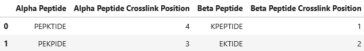
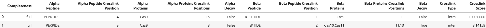
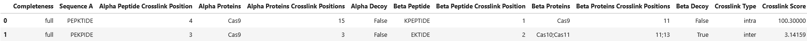
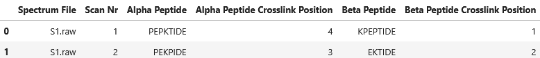
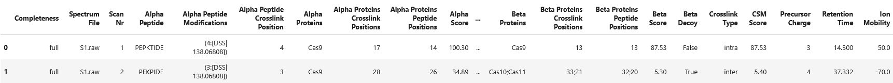
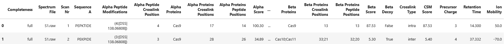

import { Callout } from 'nextra/components'

# Reading pyXLMS and Custom Files


```python copy
from pyXLMS import __version__

print(f"Installed pyXLMS version: {__version__}")
```
<Callout emoji="✓">
```
    Installed pyXLMS version: 1.5.2
```
</Callout>


```python copy
from pyXLMS import parser
from pyXLMS import transform
```

All functionality to parse crosslink-spectrum-matches (CSMs) and crosslinks (XLs) from pyXLMS files or in custom format is available via the `parser` submodule. We also import the `transform` submodule to show some summary statistics of the read files.

## Description of the pyXLMS Format

Reading files with `parser.read(*, engine="Custom")` requires the following data format for crosslinks and crosslink-spectrum-matches. While the column names can be adjusted via the parameter
`column_mapping`, the format of the columns needs to stay the same for successful parsing. Any column that is not required can be safely omitted. This format is also output by
`transform.to_dataframe()`.

## Supported File Formats

The `parser.read(*, engine="Custom")` \[[docs](https://hgb-bin-proteomics.github.io/pyXLMS/pyXLMS.parser.html#pyXLMS.parser.read)\] and `parser.read_custom()` \[[docs](https://hgb-bin-proteomics.github.io/pyXLMS/pyXLMS.parser.html#pyXLMS.parser.parser_xldbse_custom.read_custom)\] functions support a wide variety of file formats:
- Any text-like format, such as `.txt`, `.tsv`, and `.csv`.
- Microsoft Excel files in `.xlsx` format.
- Parquet files in `.parquet` format.

## Crosslinks

Data required for parsing crosslinks:

| Column Name                        | Required | Data Type | Example 1 | Example 2     | Description |
|:-----------------------------------|:--------:|:----------|:----------|:--------------|:------------|
| Alpha Peptide                      | ✅       | str       | PEPKTIDE  | KPEPTIDE      | Unmodified amino acid sequence of the alpha peptide in uppercase letters |
| Alpha Peptide Crosslink Position   | ✅       | int       | 4         | 1             | Position of the crosslinker in the alpha peptide (1-based) |
| Alpha Proteins                     | ❌       | str       | G3ECR1    | G3ECR1;J7RUA5 | Accession of the associated protein(s) of the alpha peptide, if multiple proteins are given they should be delimited by a semicolon |
| Alpha Proteins Crosslink Positions | ❌       | int, str  | 13        | 13;15         | Position of the crosslinker in the associated alpha protein(s), positions in multiple proteins should be delimited by a semicolon (1-based) |
| Alpha Decoy                        | ❌       | bool, str | False     | True          | Whether the alpha peptide is from the target (False) or decoy (True) database |
| Beta Peptide                       | ✅       | str       | PEPKTIDE  | KPEPTIDE      | Unmodified amino acid sequence of the beta peptide in uppercase letters |
| Beta Peptide Crosslink Position    | ✅       | int       | 4         | 1             | Position of the crosslinker in the beta peptide (1-based) |
| Beta Proteins                      | ❌       | str       | G3ECR1    | G3ECR1;J7RUA5 | Accession of the associated protein(s) of the beta peptide, if multiple proteins are given they should be delimited by a semicolon |
| Beta Proteins Crosslink Positions  | ❌       | int, str  | 13        | 13;15         | Position of the crosslinker in the associated beta protein(s), positions in multiple proteins should be delimited by a semicolon (1-based) |
| Beta Decoy                         | ❌       | bool, str | False     | True          | Whether the beta peptide is from the target (False) or decoy (True) database |
| Crosslink Score                    | ❌       | float     | 0.99513   | 170.3         | Score of the crosslink |

Additional resources:
- [API Documentation of the parser](https://hgb-bin-proteomics.github.io/pyXLMS/pyXLMS.parser.html#pyXLMS.parser.read)
- [API Documentation of the crosslink creator](https://hgb-bin-proteomics.github.io/pyXLMS/pyXLMS.html#pyXLMS.data.create_crosslink)

## Reading Crosslink Result Files via `parser.read()`

Functionality is demostrated with a few examples as shown below.

### Example 1

Let's consider the file `../../data/pyxlms/xl_min.txt` with the following contents:

```text
Alpha Peptide,Alpha Peptide Crosslink Position,Beta Peptide,Beta Peptide Crosslink Position
PEPKTIDE,4,KPEPTIDE,1
PEKPIDE,3,EKTIDE,2
```


```python copy
import pandas as pd

xl_min = pd.read_csv("../../data/pyxlms/xl_min.txt")
xl_min
```


<Callout emoji="✓">



</Callout>


It contains two crosslinks with minimal information.


```python copy
parser_result = parser.read(
    "../../data/pyxlms/xl_min.txt",
    engine="Custom",
    crosslinker="DSS",
)
```
<Callout emoji="✓">
```
    Reading crosslinks...: 100%|███████████████████████████████████████████████████████████████████████████████████████████████████| 2/2 [00:00<?, ?it/s]
```
</Callout>

We can read this file using the `parser.read()` method and setting `engine="Custom"`. The method also requires us to specify the used crosslinker, in this case we just assume that DSS was used (`crosslinker="DSS"`). You can read the documentation for the `parser.read()` method here: [**docs**](https://hgb-bin-proteomics.github.io/pyXLMS/pyXLMS.parser.html#pyXLMS.parser.read).


```python copy
for k, v in parser_result.items():
    print(f"{k}: {type(v) if isinstance(v, list) else v}")
```
<Callout emoji="✓">
```
    data_type: parser_result
    completeness: partial
    search_engine: Custom
    crosslink-spectrum-matches: None
    crosslinks: <class 'list'>
```
</Callout>

The `parser.read()` method returns a dictionary with a set of specified keys and their values. We refer to this dictionary as a `parser_result` object. All `parser.read*` methods return such a `parser_result` object, you can read more about that here: [**docs**](https://hgb-bin-proteomics.github.io/pyXLMS/pyXLMS.html#pyXLMS.data.create_parser_result), and here: [**data types specification**](https://github.com/hgb-bin-proteomics/pyXLMS/blob/master/docs/data_types.md).

We would be able to access the read crosslinks via `parser_result["crosslinks"]`.


```python copy
_ = transform.summary(parser_result)
```
<Callout emoji="✓">
```
    Number of crosslinks: 2.0
    Number of unique crosslinks by peptide: 2.0
    Number of unique crosslinks by protein: nan
    Number of intra crosslinks: 0.0
    Number of inter crosslinks: 2.0
    Number of target-target crosslinks: 0.0
    Number of target-decoy crosslinks: 0.0
    Number of decoy-decoy crosslinks: 0.0
    Minimum crosslink score: nan
    Maximum crosslink score: nan
```
</Callout>

With the `transform.summary()` method we can also print out some summary statistics about the read crosslinks. You can read more about the method here: [**docs**](https://hgb-bin-proteomics.github.io/pyXLMS/pyXLMS.transform.html#pyXLMS.transform.summary.summary).


```python copy
sample_crosslink = parser_result["crosslinks"][0]
for k, v in sample_crosslink.items():
    print(f"{k}: {v}")
```
<Callout emoji="✓">
```
    data_type: crosslink
    completeness: partial
    alpha_peptide: KPEPTIDE
    alpha_peptide_crosslink_position: 1
    alpha_proteins: None
    alpha_proteins_crosslink_positions: None
    alpha_decoy: None
    beta_peptide: PEPKTIDE
    beta_peptide_crosslink_position: 4
    beta_proteins: None
    beta_proteins_crosslink_positions: None
    beta_decoy: None
    crosslink_type: inter
    score: None
    additional_information: None
```
</Callout>

Here is the first parsed crosslink as an example. As you can see most of the values are `None` because we only had minimal information in our `xl_min.txt` file. You can learn more about the specific attributes and their values here: [**docs**](https://hgb-bin-proteomics.github.io/pyXLMS/pyXLMS.html#pyXLMS.data.create_crosslink), and here: [**data types specification**](https://github.com/hgb-bin-proteomics/pyXLMS/blob/master/docs/data_types.md).

*****

### Example 2

Let's consider the file `../../data/pyxlms/xl.txt` with the following contents:

```text
Completeness,Alpha Peptide,Alpha Peptide Crosslink Position,Alpha Proteins,Alpha Proteins Crosslink Positions,Alpha Decoy,Beta Peptide,Beta Peptide Crosslink Position,Beta Proteins,Beta Proteins Crosslink Positions,Beta Decoy,Crosslink Type,Crosslink Score
full,PEPKTIDE,4,Cas9,15,False,KPEPTIDE,1,Cas9,11,False,intra,100.3
full,PEKPIDE,3,Cas9,3,False,EKTIDE,2,"Cas10;Cas11","11;13",True,inter,3.14159
```


```python copy
xl = pd.read_csv("../../data/pyxlms/xl.txt")
xl
```


<Callout emoji="✓">



</Callout>


It contains two crosslinks with all possibly associated information.


```python copy
parser_result = parser.read(
    "../../data/pyxlms/xl.txt",
    engine="Custom",
    crosslinker="DSS",
)
```
<Callout emoji="✓">
```
    Reading crosslinks...: 100%|███████████████████████████████████████████████████████████████████████████████████████████████████| 2/2 [00:00<?, ?it/s]
```
</Callout>

Exactly as before, we can read this file using the `parser.read()` method and setting `engine="Custom"`. The method also requires us to specify the used crosslinker, in this case we just assume that DSS was used (`crosslinker="DSS"`). You can read the documentation for the `parser.read()` method here: [**docs**](https://hgb-bin-proteomics.github.io/pyXLMS/pyXLMS.parser.html#pyXLMS.parser.read).


```python copy
sample_crosslink = parser_result["crosslinks"][0]
for k, v in sample_crosslink.items():
    print(f"{k}: {v}")
```
<Callout emoji="✓">
```
    data_type: crosslink
    completeness: full
    alpha_peptide: KPEPTIDE
    alpha_peptide_crosslink_position: 1
    alpha_proteins: ['Cas9']
    alpha_proteins_crosslink_positions: [11]
    alpha_decoy: False
    beta_peptide: PEPKTIDE
    beta_peptide_crosslink_position: 4
    beta_proteins: ['Cas9']
    beta_proteins_crosslink_positions: [15]
    beta_decoy: False
    crosslink_type: intra
    score: 100.3
    additional_information: None
```
</Callout>

Here is again the first parsed crosslink as an example. As you can see all of the values are set here because we have all the information that pyXLMS supports in our `xl.txt` file. You can learn more about the specific attributes and their values here: [**docs**](https://hgb-bin-proteomics.github.io/pyXLMS/pyXLMS.html#pyXLMS.data.create_crosslink), and here: [**data types specification**](https://github.com/hgb-bin-proteomics/pyXLMS/blob/master/docs/data_types.md).

*****

### Example 3

Let's consider the file `../../data/pyxlms/xl_format.txt` with the following contents:

```text
Completeness,Sequence A,Alpha Peptide Crosslink Position,Alpha Proteins,Alpha Proteins Crosslink Positions,Alpha Decoy,Beta Peptide,Beta Peptide Crosslink Position,Beta Proteins,Beta Proteins Crosslink Positions,Beta Decoy,Crosslink Type,Crosslink Score
full,PEPKTIDE,4,Cas9,15,False,KPEPTIDE,1,Cas9,11,False,intra,100.3
full,PEKPIDE,3,Cas9,3,False,EKTIDE,2,"Cas10;Cas11","11;13",True,inter,3.14159
```


```python copy
xl_format = pd.read_csv("../../data/pyxlms/xl_format.txt")
xl_format
```


<Callout emoji="✓">



</Callout>


Just like in example 2, it contains two crosslinks with all possibly associated information, _but the column names do not match the pyXLMS specification!_


```python copy
parser_result = parser.read(
    "../../data/pyxlms/xl_format.txt",
    engine="Custom",
    crosslinker="DSS",
    column_mapping={"Sequence A": "Alpha Peptide"},
)
```
<Callout emoji="✓">
```
    Reading crosslinks...: 100%|███████████████████████████████████████████████████████████████████████████████████████████████████| 2/2 [00:00<?, ?it/s]
```
</Callout>

Exactly as before, we can read this file using the `parser.read()` method and setting `engine="Custom"`, however this time we also have to specify the parameter `column_mapping` which tells the parser where to look for the required information. The parameter `column_mapping` should be a dictionary that maps the column names of your file to the required column names of pyXLMS, in this example we map `"Sequence A"` to `"Alpha Peptide"`. The method also requires us to specify the used crosslinker, in this case we just assume that DSS was used (`crosslinker="DSS"`). You can read the documentation for the `parser.read()` method here: [**docs**](https://hgb-bin-proteomics.github.io/pyXLMS/pyXLMS.parser.html#pyXLMS.parser.read), and the documentation for the `column_mapping` parameter can be found here: [**docs**](https://hgb-bin-proteomics.github.io/pyXLMS/pyXLMS.parser.html#pyXLMS.parser.parser_xldbse_custom.read_custom).


```python copy
sample_crosslink = parser_result["crosslinks"][0]
for k, v in sample_crosslink.items():
    print(f"{k}: {v}")
```
<Callout emoji="✓">
```
    data_type: crosslink
    completeness: full
    alpha_peptide: KPEPTIDE
    alpha_peptide_crosslink_position: 1
    alpha_proteins: ['Cas9']
    alpha_proteins_crosslink_positions: [11]
    alpha_decoy: False
    beta_peptide: PEPKTIDE
    beta_peptide_crosslink_position: 4
    beta_proteins: ['Cas9']
    beta_proteins_crosslink_positions: [15]
    beta_decoy: False
    crosslink_type: intra
    score: 100.3
    additional_information: None
```
</Callout>

Here is again the first parsed crosslink as an example. As you can see all of the values are set here because we have all the information that pyXLMS supports in our `xl_format.txt` file, the only difference to example 2 was the column names. You can learn more about the specific attributes and their values here: [**docs**](https://hgb-bin-proteomics.github.io/pyXLMS/pyXLMS.html#pyXLMS.data.create_crosslink), and here: [**data types specification**](https://github.com/hgb-bin-proteomics/pyXLMS/blob/master/docs/data_types.md).

*****

## Crosslink-Spectrum-Matches

Data required for parsing crosslink-spectrum-matches:

| Column Name                        | Required | Data Type | Example 1 | Example 2     | Description |
|:-----------------------------------|:--------:|:----------|:----------|:--------------|:------------|
| Alpha Peptide                      | ✅       | str       | PEPKTIDE  | KPEPMTIDE     | Unmodified amino acid sequence of the alpha peptide in uppercase letters |
| Alpha Peptide Modifications        | ❌       | str       | (4:[DSS\|138.06808]) | (1:[DSS\|138.06808]);(5:[Oxidation\|15.994915]) | Modifications of the alpha peptide, see ➡️ [Modification Encoding](#modification-encoding) |
| Alpha Peptide Crosslink Position   | ✅       | int       | 4         | 1             | Position of the crosslinker in the alpha peptide (1-based) |
| Alpha Proteins                     | ❌       | str       | G3ECR1    | G3ECR1;J7RUA5 | Accession of the associated protein(s) of the alpha peptide, if multiple proteins are given they should be delimited by a semicolon |
| Alpha Proteins Crosslink Positions | ❌       | int, str  | 13        | 13;15         | Position of the crosslinker in the associated alpha protein(s), positions in multiple proteins should be delimited by a semicolon (1-based) |
| Alpha Proteins Peptide Positions   | ❌       | int, str  | 10        | 13;15         | Position of the alpha peptide in the associated alpha protein(s), positions in multiple proteins should be delimited by a semicolon (1-based) |
| Alpha Score                        | ❌       | float     | 0.837     | 45.73         | Score of the alpha peptide |
| Alpha Decoy                        | ❌       | bool, str | False     | True          | Whether the alpha peptide is from the target (False) or decoy (True) database |
| Beta Peptide                       | ✅       | str       | PEPKTIDE  | KPEPTIDE      | Unmodified amino acid sequence of the beta peptide in uppercase letters |
| Beta Peptide Modifications         | ❌       | str       | (4:[DSS\|138.06808]) | (1:[DSS\|138.06808]);(5:[Oxidation\|15.994915]) | Modifications of the beta peptide, see ➡️ [Modification Encoding](#modification-encoding) |
| Beta Peptide Crosslink Position    | ✅       | int       | 4         | 1             | Position of the crosslinker in the beta peptide (1-based) |
| Beta Proteins                      | ❌       | str       | G3ECR1    | G3ECR1;J7RUA5 | Accession of the associated protein(s) of the beta peptide, if multiple proteins are given they should be delimited by a semicolon |
| Beta Proteins Crosslink Positions  | ❌       | int, str  | 13        | 13;15         | Position of the crosslinker in the associated beta protein(s), positions in multiple proteins should be delimited by a semicolon (1-based) |
| Beta Proteins Peptide Positions    | ❌       | int, str  | 10        | 13;15         | Position of the beta peptide in the associated beta protein(s), positions in multiple proteins should be delimited by a semicolon (1-based) |
| Beta Score                         | ❌       | float     | 0.837     | 45.73         | Score of the beta peptide |
| Beta Decoy                         | ❌       | bool, str | False     | True          | Whether the beta peptide is from the target (False) or decoy (True) database |
| CSM Score                          | ❌       | float     | 0.99513   | 170.3         | Score of the crosslink-spectrum-match |
| Spectrum File                      | ✅       | str       | 2025_03_17_EXP1_RUN3_R1.raw | 2025_03_17_EXP1_RUN3_R1 | File name of the spectrum file |
| Scan Nr                            | ✅       | int       | 1703      | 38901         | The scan number of the spectrum the match was identified in |
| Precursor Charge                   | ❌       | int       | 3         | 4             | Precursor charge of the crosslink spectrum |
| Retention Time                     | ❌       | float     | 530.17    | 1701.7        | Retention time of the crosslink spectrum in seconds |
| Ion Mobility                       | ❌       | float     | 170.41    | -50.0         | Ion mobility, CCS, or compensation voltage of the crosslink spectrum |

Additional resources:
- [API Documentation of the parser](https://hgb-bin-proteomics.github.io/pyXLMS/pyXLMS.parser.html#pyXLMS.parser.read)
- [API Documentation of the crosslink-spectrum-match creator](https://hgb-bin-proteomics.github.io/pyXLMS/pyXLMS.html#pyXLMS.data.create_csm)

## Modification Encoding

Modifications are encoded with the following values:

- _position_: The 1-based position of the modification in the peptide sequence
  - should be parse-able as `int` data type
- _name_: The name of the modification, for example `Oxidation`
  - should be parse-able as `str` data type
- _mass_: The monoisotopic delta mass of the modification, for example `15.994915`
  - should be parse-able as `float` data type

Any modification is then encoded as `(position:[name|mass])`, multiple modifications should be delimited by a semicolon `;`. In the rare case that there is more than one modification on the
same position, their names should be delimited by a comma `,`. See examples below:

- `(4:[DSS|138.06808])`
- `(1:[DSS|138.06808]);(5:[Oxidation|15.994915])`
- `(5:[Substitution, Oxidation|13.541798])`

## Reading Crosslink-Spectrum-Match Result Files via `parser.read()`

Functionality is demostrated with a few examples as shown below.

### Example 1

Let's consider the file `../../data/pyxlms/csm_min.txt` with the following contents:

```text
Spectrum File,Scan Nr,Alpha Peptide,Alpha Peptide Crosslink Position,Beta Peptide,Beta Peptide Crosslink Position
S1.raw,1,PEPKTIDE,4,KPEPTIDE,1
S1.raw,2,PEKPIDE,3,EKTIDE,2
```


```python copy
csm_min = pd.read_csv("../../data/pyxlms/csm_min.txt")
csm_min
```


<Callout emoji="✓">



</Callout>


It contains two crosslink-spectrum-matches with minimal information.


```python copy
parser_result = parser.read(
    "../../data/pyxlms/csm_min.txt",
    engine="Custom",
    crosslinker="DSS",
)
```
<Callout emoji="✓">
```
    Reading CSMs...: 100%|█████████████████████████████████████████████████████████████████████████████████████████████████████████| 2/2 [00:00<?, ?it/s]
```
</Callout>

We can read this file using the `parser.read()` method and setting `engine="Custom"`. The method also requires us to specify the used crosslinker, in this case we just assume that DSS was used (`crosslinker="DSS"`). You can read the documentation for the `parser.read()` method here: [**docs**](https://hgb-bin-proteomics.github.io/pyXLMS/pyXLMS.parser.html#pyXLMS.parser.read).


```python copy
for k, v in parser_result.items():
    print(f"{k}: {type(v) if isinstance(v, list) else v}")
```
<Callout emoji="✓">
```
    data_type: parser_result
    completeness: partial
    search_engine: Custom
    crosslink-spectrum-matches: <class 'list'>
    crosslinks: None
```
</Callout>

The `parser.read()` method returns a dictionary with a set of specified keys and their values. We refer to this dictionary as a `parser_result` object. All `parser.read*` methods return such a `parser_result` object, you can read more about that here: [**docs**](https://hgb-bin-proteomics.github.io/pyXLMS/pyXLMS.html#pyXLMS.data.create_parser_result), and here: [**data types specification**](https://github.com/hgb-bin-proteomics/pyXLMS/blob/master/docs/data_types.md).

We would be able to access the read crosslink-spectrum-matches via `parser_result["crosslink-spectrum-matches"]`.


```python copy
_ = transform.summary(parser_result)
```
<Callout emoji="✓">
```
    Number of CSMs: 2.0
    Number of unique CSMs: 2.0
    Number of intra CSMs: 0.0
    Number of inter CSMs: 2.0
    Number of target-target CSMs: 0.0
    Number of target-decoy CSMs: 0.0
    Number of decoy-decoy CSMs: 0.0
    Minimum CSM score: nan
    Maximum CSM score: nan
```
</Callout>

With the `transform.summary()` method we can also print out some summary statistics about the read crosslink-spectrum-matches. You can read more about the method here: [**docs**](https://hgb-bin-proteomics.github.io/pyXLMS/pyXLMS.transform.html#pyXLMS.transform.summary.summary).


```python copy
sample_csm = parser_result["crosslink-spectrum-matches"][0]
for k, v in sample_csm.items():
    print(f"{k}: {v}")
```
<Callout emoji="✓">
```
    data_type: crosslink-spectrum-match
    completeness: partial
    alpha_peptide: KPEPTIDE
    alpha_modifications: None
    alpha_peptide_crosslink_position: 1
    alpha_proteins: None
    alpha_proteins_crosslink_positions: None
    alpha_proteins_peptide_positions: None
    alpha_score: None
    alpha_decoy: None
    beta_peptide: PEPKTIDE
    beta_modifications: None
    beta_peptide_crosslink_position: 4
    beta_proteins: None
    beta_proteins_crosslink_positions: None
    beta_proteins_peptide_positions: None
    beta_score: None
    beta_decoy: None
    crosslink_type: inter
    score: None
    spectrum_file: S1.raw
    scan_nr: 1
    charge: None
    retention_time: None
    ion_mobility: None
    additional_information: None
```
</Callout>

Here is the first parsed crosslink-spectrum-match as an example. As you can see most of the values are `None` because we only had minimal information in our `csm_min.txt` file. You can learn more about the specific attributes and their values here: [**docs**](https://hgb-bin-proteomics.github.io/pyXLMS/pyXLMS.html#pyXLMS.data.create_csm), and here: [**data types specification**](https://github.com/hgb-bin-proteomics/pyXLMS/blob/master/docs/data_types.md).

*****

### Example 2

Let's consider the file `../../data/pyxlms/csm.txt` with the following contents:

```text
Completeness,Spectrum File,Scan Nr,Alpha Peptide,Alpha Peptide Modifications,Alpha Peptide Crosslink Position,Alpha Proteins,Alpha Proteins Crosslink Positions,Alpha Proteins Peptide Positions,Alpha Score,Alpha Decoy,Beta Peptide,Beta Peptide Modifications,Beta Peptide Crosslink Position,Beta Proteins,Beta Proteins Crosslink Positions,Beta Proteins Peptide Positions,Beta Score,Beta Decoy,Crosslink Type,CSM Score,Precursor Charge,Retention Time,Ion Mobility
full,S1.raw,1,PEPKTIDE,"(4:[DSS|138.06808])",4,Cas9,17,14,100.3,False,KPEPTIDE,"(1:[DSS|138.06808])",1,Cas9,13,13,87.53,False,intra,87.53,3,14.3,50.0
full,S1.raw,2,PEKPIDE,"(3:[DSS|138.06808])",3,Cas9,28,26,34.89,False,EKTIDEM,(2:[DSS|138.06808]);(7:[Oxidation|15.994915]),2,"Cas10;Cas11","33;21","32;20",5.3,True,inter,5.4,4,37.332,-70
```


```python copy
csm = pd.read_csv("../../data/pyxlms/csm.txt")
csm
```


<Callout emoji="✓">



</Callout>


It contains two crosslink-spectrum-matches with all possibly associated information.


```python copy
parser_result = parser.read(
    "../../data/pyxlms/csm.txt",
    engine="Custom",
    crosslinker="DSS",
)
```
<Callout emoji="✓">
```
    Reading CSMs...: 100%|█████████████████████████████████████████████████████████████████████████████████████████████████████████| 2/2 [00:00<?, ?it/s]
```
</Callout>

Exactly as before, we can read this file using the `parser.read()` method and setting `engine="Custom"`. The method also requires us to specify the used crosslinker, in this case we just assume that DSS was used (`crosslinker="DSS"`). You can read the documentation for the `parser.read()` method here: [**docs**](https://hgb-bin-proteomics.github.io/pyXLMS/pyXLMS.parser.html#pyXLMS.parser.read).


```python copy
sample_csm = parser_result["crosslink-spectrum-matches"][0]
for k, v in sample_csm.items():
    print(f"{k}: {v}")
```
<Callout emoji="✓">
```
    data_type: crosslink-spectrum-match
    completeness: full
    alpha_peptide: KPEPTIDE
    alpha_modifications: {1: ('DSS', 138.06808)}
    alpha_peptide_crosslink_position: 1
    alpha_proteins: ['Cas9']
    alpha_proteins_crosslink_positions: [13]
    alpha_proteins_peptide_positions: [13]
    alpha_score: 87.53
    alpha_decoy: False
    beta_peptide: PEPKTIDE
    beta_modifications: {4: ('DSS', 138.06808)}
    beta_peptide_crosslink_position: 4
    beta_proteins: ['Cas9']
    beta_proteins_crosslink_positions: [17]
    beta_proteins_peptide_positions: [14]
    beta_score: 100.3
    beta_decoy: False
    crosslink_type: intra
    score: 87.53
    spectrum_file: S1.raw
    scan_nr: 1
    charge: 3
    retention_time: 14.3
    ion_mobility: 50.0
    additional_information: None
```
</Callout>

Here is again the first parsed crosslink-spectrum-match as an example. As you can see all of the values are set here because we have all the information that pyXLMS supports in our `csm.txt` file. You can learn more about the specific attributes and their values here: [**docs**](https://hgb-bin-proteomics.github.io/pyXLMS/pyXLMS.html#pyXLMS.data.create_csm), and here: [**data types specification**](https://github.com/hgb-bin-proteomics/pyXLMS/blob/master/docs/data_types.md).

*****

### Example 3

Let's consider the file `../../data/pyxlms/csm_format.txt` with the following contents:

```text
Completeness,Spectrum File,Scan Nr,Sequence A,Alpha Peptide Modifications,Alpha Peptide Crosslink Position,Alpha Proteins,Alpha Proteins Crosslink Positions,Alpha Proteins Peptide Positions,Alpha Score,Alpha Decoy,Beta Peptide,Beta Peptide Modifications,Beta Peptide Crosslink Position,Beta Proteins,Beta Proteins Crosslink Positions,Beta Proteins Peptide Positions,Beta Score,Beta Decoy,Crosslink Type,CSM Score,Precursor Charge,Retention Time,Ion Mobility
full,S1.raw,1,PEPKTIDE,"(4:[DSS|138.06808])",4,Cas9,17,14,100.3,False,KPEPTIDE,"(1:[DSS|138.06808])",1,Cas9,13,13,87.53,False,intra,87.53,3,14.3,50.0
full,S1.raw,2,PEKPIDE,"(3:[DSS|138.06808])",3,Cas9,28,26,34.89,False,EKTIDEM,(2:[DSS|138.06808]);(7:[Oxidation|15.994915]),2,"Cas10;Cas11","33;21","32;20",5.3,True,inter,5.4,4,37.332,-70
```


```python copy
csm_format = pd.read_csv("../../data/pyxlms/csm_format.txt")
csm_format
```


<Callout emoji="✓">



</Callout>


Just like in example 2, it contains two crosslink-spectrum-matches with all possibly associated information, _but the column names do not match the pyXLMS specification!_


```python copy
parser_result = parser.read(
    "../../data/pyxlms/csm_format.txt",
    engine="Custom",
    crosslinker="DSS",
    column_mapping={"Sequence A": "Alpha Peptide"},
)
```
<Callout emoji="✓">
```
    Reading CSMs...: 100%|█████████████████████████████████████████████████████████████████████████████████████████████████████████| 2/2 [00:00<?, ?it/s]
```
</Callout>

Exactly as before, we can read this file using the `parser.read()` method and setting `engine="Custom"`, however this time we also have to specify the parameter `column_mapping` which tells the parser where to look for the required information. The parameter `column_mapping` should be a dictionary that maps the column names of your file to the required column names of pyXLMS, in this example we map `"Sequence A"` to `"Alpha Peptide"`. The method also requires us to specify the used crosslinker, in this case we just assume that DSS was used (`crosslinker="DSS"`). You can read the documentation for the `parser.read()` method here: [**docs**](https://hgb-bin-proteomics.github.io/pyXLMS/pyXLMS.parser.html#pyXLMS.parser.read), and the documentation for the `column_mapping` parameter can be found here: [**docs**](https://hgb-bin-proteomics.github.io/pyXLMS/pyXLMS.parser.html#pyXLMS.parser.parser_xldbse_custom.read_custom).


```python copy
sample_csm = parser_result["crosslink-spectrum-matches"][0]
for k, v in sample_csm.items():
    print(f"{k}: {v}")
```
<Callout emoji="✓">
```
    data_type: crosslink-spectrum-match
    completeness: full
    alpha_peptide: KPEPTIDE
    alpha_modifications: {1: ('DSS', 138.06808)}
    alpha_peptide_crosslink_position: 1
    alpha_proteins: ['Cas9']
    alpha_proteins_crosslink_positions: [13]
    alpha_proteins_peptide_positions: [13]
    alpha_score: 87.53
    alpha_decoy: False
    beta_peptide: PEPKTIDE
    beta_modifications: {4: ('DSS', 138.06808)}
    beta_peptide_crosslink_position: 4
    beta_proteins: ['Cas9']
    beta_proteins_crosslink_positions: [17]
    beta_proteins_peptide_positions: [14]
    beta_score: 100.3
    beta_decoy: False
    crosslink_type: intra
    score: 87.53
    spectrum_file: S1.raw
    scan_nr: 1
    charge: 3
    retention_time: 14.3
    ion_mobility: 50.0
    additional_information: None
```
</Callout>

Here is again the first parsed crosslink-spectrum-match as an example. As you can see all of the values are set here because we have all the information that pyXLMS supports in our `csm_format.txt` file, the only difference to example 2 was the column names. You can learn more about the specific attributes and their values here: [**docs**](https://hgb-bin-proteomics.github.io/pyXLMS/pyXLMS.html#pyXLMS.data.create_csm), and here: [**data types specification**](https://github.com/hgb-bin-proteomics/pyXLMS/blob/master/docs/data_types.md).

*****

## Reading Result Files via `parser.read_custom()`


```python copy
parser_result = parser.read_custom(
    ["../../data/pyxlms/xl.txt", "../../data/pyxlms/csm.txt"]
)
```
<Callout emoji="✓">
```
    Reading crosslinks...: 100%|███████████████████████████████████████████████████████████████████████████████████████████████████| 2/2 [00:00<?, ?it/s]
    Reading CSMs...: 100%|█████████████████████████████████████████████████████████████████████████████████████████████████████████| 2/2 [00:00<?, ?it/s]
```
</Callout>

We can also read any of the result files using the `parser.read_custom()` method which allows a more nuanced control over reading the result files - even though theoretically everything can be done with the `parser.read()` function as well. You can read the documentation for the `parser.read_custom()` method here: [**docs**](https://hgb-bin-proteomics.github.io/pyXLMS/pyXLMS.parser.html#pyXLMS.parser.parser_xldbse_custom.read_custom).


```python copy
_ = transform.summary(parser_result)
```
<Callout emoji="✓">
```
    Number of CSMs: 2.0
    Number of unique CSMs: 2.0
    Number of intra CSMs: 1.0
    Number of inter CSMs: 1.0
    Number of target-target CSMs: 1.0
    Number of target-decoy CSMs: 1.0
    Number of decoy-decoy CSMs: 0.0
    Minimum CSM score: 5.4
    Maximum CSM score: 87.53
    Number of crosslinks: 2.0
    Number of unique crosslinks by peptide: 2.0
    Number of unique crosslinks by protein: 2.0
    Number of intra crosslinks: 1.0
    Number of inter crosslinks: 1.0
    Number of target-target crosslinks: 1.0
    Number of target-decoy crosslinks: 1.0
    Number of decoy-decoy crosslinks: 0.0
    Minimum crosslink score: 3.14159
    Maximum crosslink score: 100.3
```
</Callout>

*****

## Reading Result Files with Custom Modifications


```python copy
from typing import Dict, Tuple


def my_modifications_parser(modifications: str) -> Dict[int, Tuple[str, float]]:
    parsed_modifications = dict()
    for mod in modifications.split(";"):
        pos = int(mod.split("(")[1].split(":")[0])
        desc = mod.split("[")[1].split("|")[0].strip()
        mass = float(mod.split("|")[1].split("]")[0])
        if pos in parsed_modifications:
            raise RuntimeError(f"Modification at position {pos} already exists!")
        parsed_modifications[pos] = (desc, mass)
    return parsed_modifications
```

You can also implement your own modification parser and pass it to `parser.read_custom()` if your modifications are encoded differently than the [pyXLMS modification encoding](#modification-encoding). The modification parser should always use a `str` as input and output a dictionary that maps peptide positions (1-based, `int`) to tuples of `(` modification name as a `str`, and modification mass as a `float` `)`.


```python copy
parser_result = parser.read_custom(
    "../../data/pyxlms/csm.txt",
    modification_parser=my_modifications_parser,
)
```
<Callout emoji="✓">
```
    Reading CSMs...: 100%|█████████████████████████████████████████████████████████████████████████████████████████████████████████| 2/2 [00:00<?, ?it/s]
```
</Callout>

The implemented modifications parser can the be passed via the `modification_parser` parameter.


```python copy
_ = transform.summary(parser_result)
```
<Callout emoji="✓">
```
    Number of CSMs: 2.0
    Number of unique CSMs: 2.0
    Number of intra CSMs: 1.0
    Number of inter CSMs: 1.0
    Number of target-target CSMs: 1.0
    Number of target-decoy CSMs: 1.0
    Number of decoy-decoy CSMs: 0.0
    Minimum CSM score: 5.4
    Maximum CSM score: 87.53
```
</Callout>

*****

There are several other parameters that can be set, you can read more about them here: [**docs**](https://hgb-bin-proteomics.github.io/pyXLMS/pyXLMS.parser.html#pyXLMS.parser.parser_xldbse_custom.read_custom).
