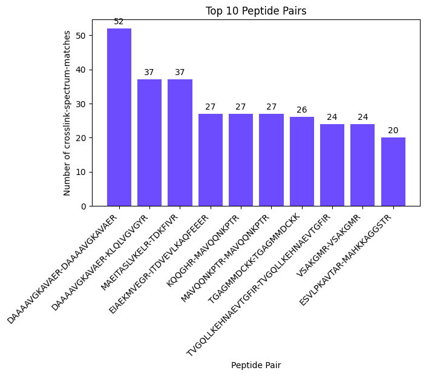

import { Callout } from 'nextra/components'

# **Plotting Peptide Pair Distribution**


```python copy
from pyXLMS import __version__

print(f"Installed pyXLMS version: {__version__}")
```
<Callout emoji="✓">
```
    Installed pyXLMS version: 1.3.0
```
</Callout>


```python copy
from pyXLMS import parser
from pyXLMS import plotting
```

All plotting functionality is available via the `plotting` submodule. We also import the `parser` submodule here for reading result files.


```python copy
parser_result = parser.read(
    "../_data/20220215_Eclipse_LC6_PepMap50cm-cartridge_mainlib_DSSO_3CV_stepHCD_OT_001.pdResult",
    engine="MS Annika",
    crosslinker="DSS",
)
```
<Callout emoji="✓">
```
    Reading MS Annika CSMs...: 100%|██████████████████████████████████████████████████████████████████████████████████████████████████| 6324/6324 [00:00<00:00, 11442.10it/s]
    Reading MS Annika crosslinks...: 100%|████████████████████████████████████████████████████████████████████████████████████████████| 3025/3025 [00:00<00:00, 20929.73it/s]
```
</Callout>

We read crosslink-spectrum-matches and crosslinks using the [generic parser](https://hgb-bin-proteomics.github.io/pyXLMS/pyXLMS.parser.html#pyXLMS.parser.read) from a single `.pdResult` file.


```python copy
fig, ax = plotting.plot_peptide_pair_distribution(
    parser_result["crosslink-spectrum-matches"],
    figsize=(15.0, 5.0),
    filename_prefix="pep_pair_dist_csms",
)
```


    

    


We can plot the peptide pair distribution for our crosslink-spectrum-matches by passing them as the first argument. The default figure size is 16 by 9 inches and does not need to be set explicitly, we just used a smaller one here for demonstration purposes. The `filename_prefix` parameter is also optional, if it is given the plot is saved four times: once without the title in `.png` and `.svg` format, and once with the title in `.png` and `.svg` format.


```python copy
fig, ax = plotting.plot_peptide_pair_distribution(
    parser_result["crosslink-spectrum-matches"],
    top_n=10,
    title="Top 10 Peptide Pairs",
    figsize=(7.0, 4.0),
)
```


    

    


We can also specify `top_n=10` to control the number of peptide pairs in our plot and additionally specify a title via the `title` parameter. Since we did not specify a `filename_prefix` the plot is not saved to disk. There are also other parameters that can be set to tune your plot like `color`, you can read more about all the possible parameters here: [**docs**](https://hgb-bin-proteomics.github.io/pyXLMS/pyXLMS.plotting.html#pyXLMS.plotting.plot_peptide_pair_distribution.plot_peptide_pair_distribution).


```python copy
fig, ax = plotting.plot_peptide_pair_distribution(
    parser_result["crosslinks"],
    top_n=10,
    title="Top 10 Peptide Pairs",
    figsize=(7.0, 4.0),
)
```
<Callout type="error">
```
    [41m---------------------------------------------------------------------------[0m

    TypeError                                 Traceback (most recent call last)

    Cell In[6], line 1
    ----> 1 fig, ax = plotting.plot_peptide_pair_distribution(
          2     parser_result["crosslinks"],
          3     top_n=10,
          4     title="Top 10 Peptide Pairs",
          5     figsize=(7.0, 4.0),
          6 )
    

    File ~\AppData\Local\Programs\Python\Python312\Lib\site-packages\pyXLMS\plotting\plot_peptide_pair_distribution.py:87, in plot_peptide_pair_distribution(data, top_n, color, title, figsize, filename_prefix)
         83     raise ValueError(
         84         "Can't plot peptide pair distribution if no crosslink-spectrum-matches are given!"
         85     )
         86 if "data_type" not in data[0] or data[0]["data_type"] != "crosslink-spectrum-match":
    ---> 87     raise TypeError(
         88         "Unsupported data type for input data! Parameter data has to be a list of crosslink-spectrum-match!"
         89     )
         90 pps = filter_peptide_pair_distribution(data)
         91 pp_names = list()
    

    TypeError: Unsupported data type for input data! Parameter data has to be a list of crosslink-spectrum-match!
```
</Callout>

> [!IMPORTANT]
>
> **The peptide pair distribution can only be plotted for crosslink-spectrum-matches since crosslinks are already aggregated by either peptide pair or protein position.**

Calling `plot_peptide_pair_distribution` on a list of crosslinks will result in an error!
