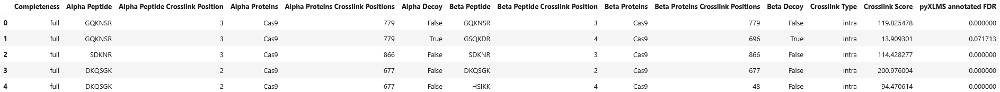

import { Callout } from 'nextra/components'

# Annotating Estimated False-Discovery-Rate


```python copy
from pyXLMS import __version__

print(f"Installed pyXLMS version: {__version__}")
```
<Callout emoji="✓">
```
    Installed pyXLMS version: 1.6.0
```
</Callout>


```python copy
from pyXLMS import parser
from pyXLMS import transform
```

All data transformation functionality - including `annotate_fdr()` - is available via the `transform` submodule. We also import the `parser` submodule here for reading result files.


```python copy
parser_result = parser.read(
    "../../data/ms_annika/XLpeplib_Beveridge_QEx-HFX_DSS_R1.pdResult",
    engine="MS Annika",
    crosslinker="DSS",
)
```
<Callout emoji="✓">
```
    Reading MS Annika CSMs...: 100%|████████████████████████████████████████████████████████████████████████████████| 826/826 [00:00<00:00, 10258.12it/s]
    Reading MS Annika crosslinks...: 100%|██████████████████████████████████████████████████████████████████████████| 300/300 [00:00<00:00, 20267.23it/s]
```
</Callout>

We read crosslink-spectrum-matches and crosslinks using the [generic parser](https://hgb-bin-proteomics.github.io/pyXLMS/pyXLMS.parser.html#pyXLMS.parser.read) from a single `.pdResult` file.


```python copy
csms = parser_result["crosslink-spectrum-matches"]
xls = parser_result["crosslinks"]
```

For easier access we assign our crosslink-spectrum-matches to the variable `csms` and our crosslinks to the variable `xls`.

## Introduction

pyXLMS offers estimated false-discovery-rate (FDR) annotation for crosslink-spectrum-matches and crosslinks via the `transform.annotate_fdr()` function. Since this function shares a similar interface to `transform.validate()` \[[docs](https://hgb-bin-proteomics.github.io/pyXLMS/pyXLMS.transform.html#pyXLMS.transform.validate.validate), [page](/docs/transform/validate)\] we also recommend the reader to get familiar with that function!

> [!IMPORTANT]
>
> **Please note that FDR annotation is not validation! If you are looking for FDR-based validation please use `transform.validate()` \[[docs](https://hgb-bin-proteomics.github.io/pyXLMS/pyXLMS.transform.html#pyXLMS.transform.validate.validate), [page](/docs/transform/validate)\] instead! FDR annotation will associate an estimated FDR value to all crosslink-spectrum-matches or crosslinks and is significantly slower (`O(n^2)` runtime) than validation!**

Before we run any kind of examples, let's have a look at the function and its parameters:

```python filename="src/pyXLMS/transform/annotate_fdr.py"
def annotate_fdr(
    data: List[Dict[str, Any]] | Dict[str, Any],
    formula: Literal["D/T", "(TD+DD)/TT", "(TD-DD)/TT"] = "D/T",
    score: Literal["higher_better", "lower_better"] = "higher_better",
    separate_intra_inter: bool = False,
    ignore_missing_labels: bool = False,
) -> List[Dict[str, Any]] | Dict[str, Any]:
```

The function has 5 possible parameters:
- **data**: A list of crosslink-spectrum-matches or crosslinks to annotate, or a `parser_result`.
- **formula**: One of `"D/T"`, `"(TD+DD)/TT"`, and `"(TD-DD)/TT"` denoting which formula to use to estimate FDR. `D` and `DD` denote decoy matches, `T` and `TT` denote target matches, and `TD` denotes target-decoy and decoy-target matches.
  - Options `"D/T"` and `"(TD+DD)/TT"` are the same and the standard way how MS Annika calculates FDR.
    - See references \[[1](https://doi.org/10.1021/acs.jproteome.0c01000), [2](https://doi.org/10.1038/s42004-024-01386-x)\].
  - Option `"(TD-DD)/TT"` is the formula suggested by xiFDR for directional crosslinks.
    - See references \[[3](https://doi.org/10.1021/acs.analchem.6b03745)\].
- **score**: One of `"higher_better"`, or `"lower_better"` denoting if a higher score is considered better, or a lower score is considered better.
- **separate_intra_inter**: If FDR should be estimated separately for intra and inter matches.
- **ignore_missing_labels**: If crosslinks and crosslink-spectrum-matches should be ignored if they don't have target and decoy labels. By default and error is thrown if any unlabelled data is encountered.

Except for `data` all other parameters are optional with sensible defaults in place to stricly estimate FDR and annotate results. The `data` parameter supports lists of crosslink-spectrum-matches or crosslinks as input, or a complete `parser_result`. If a list of crosslink-spectrum-matches was provided, `annotated_fdr()` will return a list of FDR annotated crosslink-spectrum-matches. If a list of crosslinks was provided, `annotate_fdr()` will return a list of FDR annotated crosslinks. If a `parser_result` was provided, `annotate_fdr()` will return a `parser_result` where all elements are FDR annotated.

## FDR Annotation of Crosslink-Spectrum-Matches


```python copy
_ = transform.summary(csms)
```
<Callout emoji="✓">
```
    Number of CSMs: 826.0
    Number of unique CSMs: 826.0
    Number of intra CSMs: 803.0
    Number of inter CSMs: 23.0
    Number of target-target CSMs: 786.0
    Number of target-decoy CSMs: 39.0
    Number of decoy-decoy CSMs: 1.0
    Minimum CSM score: 1.1132827525593785
    Maximum CSM score: 452.9861536355926
```
</Callout>

Before annotation, let's have a look at our crosslink-spectrum-matches using the `transform.summary()` function which you can read more about here: [**docs**](https://hgb-bin-proteomics.github.io/pyXLMS/pyXLMS.transform.html#pyXLMS.transform.summary.summary).


```python copy
csms = transform.annotate_fdr(csms)
```
<Callout emoji="✓">
```
    Annotating FDR for crosslink-spectrum-matches...: 100%|█████████████████████████████████████████████████████████| 826/826 [00:00<00:00, 26426.76it/s]
```
</Callout>

We can annotate our CSMs using the `transform.annotate_fdr()` function. For strict FDR annotation we can leave all optional parameters at their default values. You can read more about the `annotate_fdr()` function and all its parameters here: [**docs**](https://hgb-bin-proteomics.github.io/pyXLMS/pyXLMS.transform.html#pyXLMS.transform.annotate_fdr.annotate_fdr).


```python copy
_ = transform.summary(csms)
```
<Callout emoji="✓">
```
    Number of CSMs: 826.0
    Number of unique CSMs: 826.0
    Number of intra CSMs: 803.0
    Number of inter CSMs: 23.0
    Number of target-target CSMs: 786.0
    Number of target-decoy CSMs: 39.0
    Number of decoy-decoy CSMs: 1.0
    Minimum CSM score: 1.1132827525593785
    Maximum CSM score: 452.9861536355926
```
</Callout>


```python copy
df = transform.to_dataframe(csms)
df["pyXLMS annotated FDR"] = [
    csm["additional_information"]["pyXLMS_annotated_FDR"] for csm in csms
]
df.head()
```
<Callout emoji="✓">


</Callout>


As a result we get the same list of crosslink-spectrum-matches that is now annotated with their FDR via strict FDR estimation.


```python copy
csms = transform.annotate_fdr(csms, formula="(TD-DD)/TT", separate_intra_inter=True)
df = transform.to_dataframe(csms)
df["pyXLMS annotated FDR"] = [
    csm["additional_information"]["pyXLMS_annotated_FDR"] for csm in csms
]
df.head()
```
<Callout emoji="✓">
```
    Annotating FDR for crosslink-spectrum-matches...: 100%|█████████████████████████████████████████████████████████| 803/803 [00:00<00:00, 26310.85it/s]
    Annotating FDR for crosslink-spectrum-matches...: 100%|██████████████████████████████████████████████████████████████████████| 23/23 [00:00<?, ?it/s]
```
</Callout>

<Callout emoji="✓">


</Callout>


Of course we can also do more relaxed FDR estimation and annotation using a different formula `formula="(TD-DD)/TT"`. We also separate FDR estimation by intra and inter matches `separate_intra_inter=True`.

*****

## FDR Annotation of Crosslinks


```python copy
_ = transform.summary(xls)
```
<Callout emoji="✓">
```
    Number of crosslinks: 300.0
    Number of unique crosslinks by peptide: 300.0
    Number of unique crosslinks by protein: 298.0
    Number of intra crosslinks: 279.0
    Number of inter crosslinks: 21.0
    Number of target-target crosslinks: 265.0
    Number of target-decoy crosslinks: 0.0
    Number of decoy-decoy crosslinks: 35.0
    Minimum crosslink score: 1.1132827525593785
    Maximum crosslink score: 452.9861536355926
```
</Callout>

Before annotation, let's have a look at our non-validated crosslinks using the `transform.summary()` function which you can read more about here: [**docs**](https://hgb-bin-proteomics.github.io/pyXLMS/pyXLMS.transform.html#pyXLMS.transform.summary.summary).


```python copy
xls = transform.annotate_fdr(xls)
```
<Callout emoji="✓">
```
    Annotating FDR for crosslinks...: 100%|█████████████████████████████████████████████████████████████████████████| 300/300 [00:00<00:00, 75005.44it/s]
```
</Callout>

Similarly to annotating CSMs, we can annotate our crosslinks using the `transform.annotate_fdr()` function. For strict FDR annotation we can leave all optional parameters at their default values. You can read more about the `annotate_fdr()` function and all its parameters here: [**docs**](https://hgb-bin-proteomics.github.io/pyXLMS/pyXLMS.transform.html#pyXLMS.transform.annotate_fdr.annotate_fdr).


```python copy
_ = transform.summary(xls)
```
<Callout emoji="✓">
```
    Number of crosslinks: 300.0
    Number of unique crosslinks by peptide: 300.0
    Number of unique crosslinks by protein: 298.0
    Number of intra crosslinks: 279.0
    Number of inter crosslinks: 21.0
    Number of target-target crosslinks: 265.0
    Number of target-decoy crosslinks: 0.0
    Number of decoy-decoy crosslinks: 35.0
    Minimum crosslink score: 1.1132827525593785
    Maximum crosslink score: 452.9861536355926
```
</Callout>


```python copy
df = transform.to_dataframe(xls)
df["pyXLMS annotated FDR"] = [
    xl["additional_information"]["pyXLMS_annotated_FDR"] for xl in xls
]
df.head()
```
<Callout emoji="✓">


</Callout>


As a result we get the same list of crosslinks that is now annotated with their FDR via strict FDR estimation.


```python copy
xls = transform.annotate_fdr(xls, separate_intra_inter=True)
df = transform.to_dataframe(xls)
df["pyXLMS annotated FDR"] = [
    xl["additional_information"]["pyXLMS_annotated_FDR"] for xl in xls
]
df.head()
```
<Callout emoji="✓">
```
    Annotating FDR for crosslinks...: 100%|█████████████████████████████████████████████████████████████████████████| 279/279 [00:00<00:00, 79557.47it/s]
    Annotating FDR for crosslinks...: 100%|██████████████████████████████████████████████████████████████████████████████████████| 21/21 [00:00<?, ?it/s]
```
</Callout>

<Callout emoji="✓">



</Callout>

Of course we can also do more relaxed FDR estimation and annotation, here using separate FDR estimation for intra and inter matches `separate_intra_inter=True`.

*****

## FDR Annotation of a `parser_result`


```python copy
parser_result = transform.annotate_fdr(parser_result)
```
<Callout emoji="✓">
```
    Annotating FDR for crosslink-spectrum-matches...: 100%|█████████████████████████████████████████████████████████| 826/826 [00:00<00:00, 25660.27it/s]
    Annotating FDR for crosslinks...: 100%|█████████████████████████████████████████████████████████████████████████| 300/300 [00:00<00:00, 74978.62it/s]
```
</Callout>

We can even annotate our complete `parser_result` using the `transform.annotate_fdr()` function as well. For annotation using a strict FDR estimation we can also leave all optional parameters at their default values. You can read more about the `annotate_fdr()` function and all its parameters here: [**docs**](https://hgb-bin-proteomics.github.io/pyXLMS/pyXLMS.transform.html#pyXLMS.transform.annotate_fdr.annotate_fdr).
