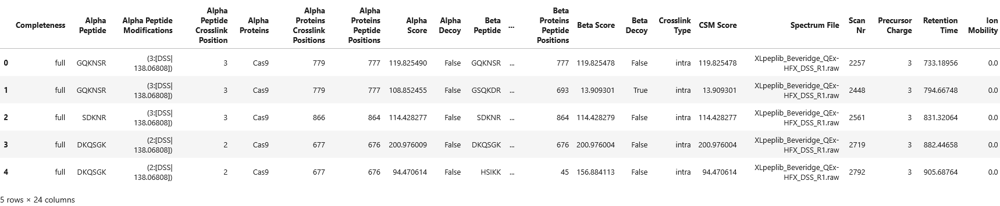
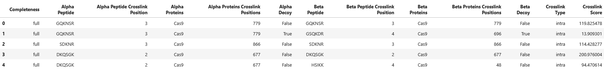

import { Callout } from 'nextra/components'

# **Result Summary and Utility Functions**


```python copy
from pyXLMS import __version__

print(f"Installed pyXLMS version: {__version__}")
```
<Callout emoji="✓">
```
    Installed pyXLMS version: 1.5.1
```
</Callout>


```python copy
from pyXLMS import parser
from pyXLMS import transform
```

All data transformation functionality is available via the `transform` submodule. We also import the `parser` submodule here for reading result files.


```python copy
parser_result = parser.read(
    "../../data/ms_annika/XLpeplib_Beveridge_QEx-HFX_DSS_R1.pdResult",
    engine="MS Annika",
    crosslinker="DSS",
)
```
<Callout emoji="✓">
```
    Reading MS Annika CSMs...: 100%|█████████████████████████████████████████████████████████████████████████████████████████████████████| 826/826 [00:00<00:00, 8136.07it/s]
    Reading MS Annika crosslinks...: 100%|██████████████████████████████████████████████████████████████████████████████████████████████| 300/300 [00:00<00:00, 13044.83it/s]
```
</Callout>

We read crosslink-spectrum-matches and crosslinks using the [generic parser](https://hgb-bin-proteomics.github.io/pyXLMS/pyXLMS.parser.html#pyXLMS.parser.read) from a single `.pdResult` file.


```python copy
csms = parser_result["crosslink-spectrum-matches"]
xls = parser_result["crosslinks"]
```

For easier access we assign our crosslink-spectrum-matches to the variable `csms` and our crosslinks to the variable `xls`.

## Result Summary


```python copy
csms_summary = transform.summary(csms)
```
<Callout emoji="✓">
```
    Number of CSMs: 826.0
    Number of unique CSMs: 826.0
    Number of intra CSMs: 803.0
    Number of inter CSMs: 23.0
    Number of target-target CSMs: 786.0
    Number of target-decoy CSMs: 39.0
    Number of decoy-decoy CSMs: 1.0
    Minimum CSM score: 1.1132827525593785
    Maximum CSM score: 452.9861536355926
```
</Callout>

We can get a summary of our crosslink-spectrum-matches by calling `transform.summary()` and passing the crosslink-spectrum-matches as the first argument. The function returns a dictionary containing summary statistics. You can read more about the `summary()` function and all its parameters here: [**docs**](https://hgb-bin-proteomics.github.io/pyXLMS/pyXLMS.transform.html#pyXLMS.transform.summary.summary).


```python copy
csms_summary
```
<Callout emoji="✓">
```
    {'Number of CSMs': 826.0,
     'Number of unique CSMs': 826.0,
     'Number of intra CSMs': 803.0,
     'Number of inter CSMs': 23.0,
     'Number of target-target CSMs': 786.0,
     'Number of target-decoy CSMs': 39.0,
     'Number of decoy-decoy CSMs': 1.0,
     'Minimum CSM score': 1.1132827525593785,
     'Maximum CSM score': 452.9861536355926}
```
</Callout>


The dictionary returned by `summary()`. By default all summary statistics are also printed to `stdout`.


```python copy
validated_csms = transform.validate(csms)
_ = transform.summary(validated_csms)
```
<Callout emoji="✓">
```
    Iterating over scores for FDR calculation...:  15%|███████████▊                                                                     | 121/826 [00:00<00:00, 30246.78it/s]

    Number of CSMs: 705.0
    Number of unique CSMs: 705.0
    Number of intra CSMs: 701.0
    Number of inter CSMs: 4.0
    Number of target-target CSMs: 699.0
    Number of target-decoy CSMs: 6.0
    Number of decoy-decoy CSMs: 0.0
    Minimum CSM score: 34.188549584398956
    Maximum CSM score: 452.9861536355926
```
</Callout>


You can also repeatedly call `summary()` after data transformation steps to see how your results change, here as an example demonstrated after validation of crosslink-spectrum-matches.


```python copy
_ = transform.summary(xls)
```
<Callout emoji="✓">
```
    Number of crosslinks: 300.0
    Number of unique crosslinks by peptide: 300.0
    Number of unique crosslinks by protein: 298.0
    Number of intra crosslinks: 279.0
    Number of inter crosslinks: 21.0
    Number of target-target crosslinks: 265.0
    Number of target-decoy crosslinks: 0.0
    Number of decoy-decoy crosslinks: 35.0
    Minimum crosslink score: 1.1132827525593785
    Maximum crosslink score: 452.9861536355926
```
</Callout>

Similarly, we can get a summary of our crosslinks by calling `transform.summary()` and passing the crosslinks as the first argument.


```python copy
_ = transform.summary(parser_result)
```
<Callout emoji="✓">
```
    Number of CSMs: 826.0
    Number of unique CSMs: 826.0
    Number of intra CSMs: 803.0
    Number of inter CSMs: 23.0
    Number of target-target CSMs: 786.0
    Number of target-decoy CSMs: 39.0
    Number of decoy-decoy CSMs: 1.0
    Minimum CSM score: 1.1132827525593785
    Maximum CSM score: 452.9861536355926
    Number of crosslinks: 300.0
    Number of unique crosslinks by peptide: 300.0
    Number of unique crosslinks by protein: 298.0
    Number of intra crosslinks: 279.0
    Number of inter crosslinks: 21.0
    Number of target-target crosslinks: 265.0
    Number of target-decoy crosslinks: 0.0
    Number of decoy-decoy crosslinks: 35.0
    Minimum crosslink score: 1.1132827525593785
    Maximum crosslink score: 452.9861536355926
```
</Callout>

Lastly, we can also get a summary of our `parser_result` by calling `transform.summary()` and passing the `parser_result` as the first argument.

## Crosslink-Spectrum-Matches and Crosslinks as `pandas` DataFrames

You might want to convert your crosslink-spectrum-matches and crosslinks to a `pandas.DataFrame` to work with [pandas](https://pandas.pydata.org/) or simply to save them to a file, for example to process them somewhere else. For this purpose the `transform.to_dataframe()` function exists: it takes a list of crosslink-spectrum-matches or crosslinks as input and returns them as a `pandas.DataFrame`. You can read more about the `to_dataframe()` function and its parameters here: [**docs**](https://hgb-bin-proteomics.github.io/pyXLMS/pyXLMS.transform.html#pyXLMS.transform.to_dataframe.to_dataframe).


```python copy
df = transform.to_dataframe(csms)
df.head(5)
```
<Callout emoji="✓">



</Callout>


Crosslink-spectrum-matches converted to a `pandas.DataFrame`.


```python copy
loaded_csms = transform.from_dataframe(df)
_ = transform.summary(loaded_csms)
```
<Callout emoji="✓">
```
    Reading CSMs...: 100%|███████████████████████████████████████████████████████████████████████████████████████████████████████████████| 826/826 [00:00<00:00, 2650.47it/s]

    Number of CSMs: 826.0
    Number of unique CSMs: 826.0
    Number of intra CSMs: 803.0
    Number of inter CSMs: 23.0
    Number of target-target CSMs: 786.0
    Number of target-decoy CSMs: 39.0
    Number of decoy-decoy CSMs: 1.0
    Minimum CSM score: 1.1132827525593785
    Maximum CSM score: 452.9861536355926
```
</Callout>


We can also load back our crosslink-spectrum-matches from the `pandas.DataFrame` using `transfrom.from_dataframe()`. You can read more about the `from_dataframe()` function and its parameters here: [**docs**](https://hgb-bin-proteomics.github.io/pyXLMS/pyXLMS.transform.html#pyXLMS.transform.from_dataframe.from_dataframe).


```python copy
df = transform.to_dataframe(xls)
df.head(5)
```
<Callout emoji="✓">



</Callout>


Similarly, we can convert our crosslinks to a `pandas.DataFrame` with `transform.to_dataframe()`...


```python copy
loaded_xls = transform.from_dataframe(df)
_ = transform.summary(loaded_xls)
```
<Callout emoji="✓">
```
    Reading crosslinks...: 100%|█████████████████████████████████████████████████████████████████████████████████████████████████████████| 300/300 [00:00<00:00, 7895.46it/s]

    Number of crosslinks: 300.0
    Number of unique crosslinks by peptide: 300.0
    Number of unique crosslinks by protein: 298.0
    Number of intra crosslinks: 279.0
    Number of inter crosslinks: 21.0
    Number of target-target crosslinks: 265.0
    Number of target-decoy crosslinks: 0.0
    Number of decoy-decoy crosslinks: 35.0
    Minimum crosslink score: 1.1132827525593785
    Maximum crosslink score: 452.9861536355926
```
</Callout>


...and load them back with `transform.from_dataframe()`.

## Crosslink-Spectrum-Matches and Crosslinks in ProForma Notation

If you want to export your crosslink-spectrum-matches or crosslinks to [ProForma](https://www.psidev.info/proforma) notation, you can do that with `transform.to_proforma()` which you can read more about here: [**docs**](https://hgb-bin-proteomics.github.io/pyXLMS/pyXLMS.transform.html#pyXLMS.transform.to_proforma.to_proforma).

Let's go through a few examples:


```python copy
csm = csms[0]
csm
```
<Callout emoji="✓">
```
    {'data_type': 'crosslink-spectrum-match',
     'completeness': 'full',
     'alpha_peptide': 'GQKNSR',
     'alpha_modifications': {3: ('DSS', 138.06808)},
     'alpha_peptide_crosslink_position': 3,
     'alpha_proteins': ['Cas9'],
     'alpha_proteins_crosslink_positions': [779],
     'alpha_proteins_peptide_positions': [777],
     'alpha_score': 119.82548987540834,
     'alpha_decoy': False,
     'beta_peptide': 'GQKNSR',
     'beta_modifications': {3: ('DSS', 138.06808)},
     'beta_peptide_crosslink_position': 3,
     'beta_proteins': ['Cas9'],
     'beta_proteins_crosslink_positions': [779],
     'beta_proteins_peptide_positions': [777],
     'beta_score': 119.82547820493929,
     'beta_decoy': False,
     'crosslink_type': 'intra',
     'score': 119.82547820493929,
     'spectrum_file': 'XLpeplib_Beveridge_QEx-HFX_DSS_R1.raw',
     'scan_nr': 2257,
     'charge': 3,
     'retention_time': 733.1895599999999,
     'ion_mobility': 0.0,
     'additional_information': None}
```
</Callout>


Let's consider the above crosslink-spectrum-match of a homeotypic crosslink where both peptides are `GQKSNR` crosslinked with DSS at the `K3`. 


```python copy
csm_proforma = transform.to_proforma(csm)
```

Calling `to_proforma()` on a crosslink-spectrum-match will give us the crosslink-spectrum-match in ProForma notation (as a `str`).


```python copy
csm_proforma
```
<Callout emoji="✓">
```
    'GQK[+138.06808]NSR//GQK[+138.06808]NSR/3'
```
</Callout>


The crosslink modifications are automatically denoted with their corresponding monoisotopic delta masses, for DSS that is `+138.06808` Da.


```python copy
csms_proforma = transform.to_proforma(csms)
```

We can also pass a list of crosslink-spectrum-matches to `to_proforma()`...


```python copy
csms_proforma[:5]
```
<Callout emoji="✓">
```
    ['GQK[+138.06808]NSR//GQK[+138.06808]NSR/3',
     'GQK[+138.06808]NSR//GSQK[+138.06808]DR/3',
     'SDK[+138.06808]NR//SDK[+138.06808]NR/3',
     'DK[+138.06808]QSGK//DK[+138.06808]QSGK/3',
     'DK[+138.06808]QSGK//HSIK[+138.06808]K/3']
```
</Callout>


...which will return a list of `str` instead, containing the corresponding crosslink-spectrum-matches in ProForma notation.


```python copy
xl = xls[0]
xl
```
<Callout emoji="✓">
```
    {'data_type': 'crosslink',
     'completeness': 'full',
     'alpha_peptide': 'GQKNSR',
     'alpha_peptide_crosslink_position': 3,
     'alpha_proteins': ['Cas9'],
     'alpha_proteins_crosslink_positions': [779],
     'alpha_decoy': False,
     'beta_peptide': 'GQKNSR',
     'beta_peptide_crosslink_position': 3,
     'beta_proteins': ['Cas9'],
     'beta_proteins_crosslink_positions': [779],
     'beta_decoy': False,
     'crosslink_type': 'intra',
     'score': 119.82547820493929,
     'additional_information': None}
```
</Callout>


Alternatively, consider the above crosslink which we get from the previous crosslink-spectrum-match: again both peptides are `GQKNSR` and are crosslinked at the `K3` residue.


```python copy
xl_proforma = transform.to_proforma(xl)
```

We can get the ProForma `str` of the crosslink by passing the crosslink as the first argument to `to_proforma()`.


```python copy
xl_proforma
```
<Callout emoji="✓">
```
    'GQKNSR//GQKNSR'
```
</Callout>


Because the crosslink in itself does not contain any information about post-translational-modifications since it is an aggregation of crosslink-spectrum-matches, the returned ProForma string does not contain the crosslinker.


```python copy
xl_proforma = transform.to_proforma(xl, crosslinker="Xlink:DSS")
xl_proforma
```
<Callout emoji="✓">
```
    'GQK[Xlink:DSS]NSR//GQK[Xlink:DSS]NSR'
```
</Callout>


We can explicitly pass the name or mass of the crosslinker via the `crosslinker` parameter to include it in the ProForma string.


```python copy
csm_proforma = transform.to_proforma(csm, crosslinker="Xlink:DSS")
csm_proforma
```
<Callout emoji="✓">
```
    'GQK[+138.06808]NSR//GQK[+138.06808]NSR/3'
```
</Callout>


Passing a crosslinker via the parameter `crosslinker` when there is already a crosslinker specified, as for example in our previous crosslink-spectrum-match, will have no effect.


```python copy
xls_proforma = transform.to_proforma(xls)
```

We can also pass a list of crosslinks to `to_proforma()`...


```python copy
xls_proforma[:5]
```
<Callout emoji="✓">
```
    ['GQKNSR//GQKNSR',
     'GQKNSR//GSQKDR',
     'SDKNR//SDKNR',
     'DKQSGK//DKQSGK',
     'DKQSGK//HSIKK']
```
</Callout>


...which will return a list of `str` instead, containing the corresponding crosslinks in ProForma notation.
