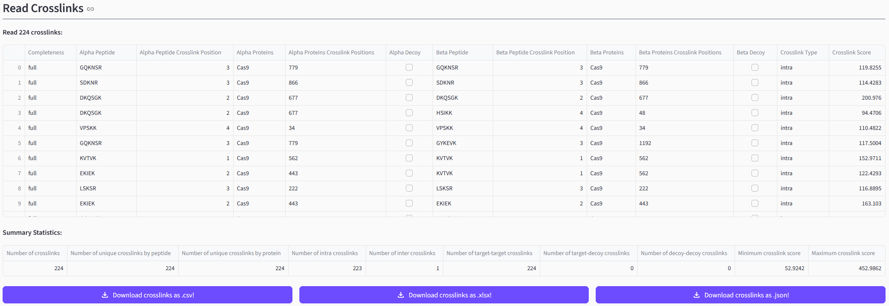

import { Steps } from 'nextra/components'

# Loading Data

## Uploading Result Files

<Steps>

### File Selection

The first step when using the pyXLMS web application is that you need to upload
one or more result files containing crosslink-spectrum-matches (CSMs) or crosslinks/residue
pairs (XLs) in the `Load Data` tab. You can find a list of supported crosslink search engines
and input formats
[here](https://github.com/hgb-bin-proteomics/pyXLMS/blob/master/docs/supported_io.md).
We also provide some example files via the
[pyXLMS GitHub repository](https://github.com/hgb-bin-proteomics/pyXLMS/tree/master/data)
that you can try!

> [!TIP]
>
> **Starting from pyXLMS v1.6.1 the web application also supports input of multiple**
> **result files, e.g. if you have CSMs and XLs from the same run, result files of**
> **different fractions of your sample, or replicates.**

### Selecting Crosslink Search Engine or File Format

Next you need to select the correct crosslink search engine or file format from the
dropdown menu. This should simply be the crosslink search engine that you used for
crosslink identification with your mass spectrometry data, or a generic format like
mzIdentML.

### Selecting Crosslink Reagent

Then you need to select the crosslinking reagent that was used in your experiment
from the next dropdown menu. If your reagent is not in the list you can select
`Custom` and two additional input fields will pop up where you can specify a
crosslinker name and the monoisotopic delta mass of the crosslink modification.

### Reading the Results

If you don't want to employ any of the additional and optional pre-processing steps
(see next section) you can read your results now by clicking on the `Read file(s)!`
button!

</Steps>

## [Optional] Pre-Processing Results

pyXLMS offers several different pre-processing steps as outlined below.

<Steps>

### [Optionally] Apply One or More Pre-Processing Steps

- **Parse Modifications**

  Enabling this option will try to parse post-translation-modifications (PTMs) of
  your CSMs from your result files.

  > [!NOTE]
  >
  > **Please note that the pyXLMS web app only supports a limited set of the most common**
  > **PTMs! If parsing fails it is better to leave this option turned off and use the pyXLMS**
  > **python package directly which gives a more nuanced control over modifications!**

- **Re-Annotate Crosslink Positions**

  This option will allow you to upload a FASTA file to re-annotate the protein crosslink
  positions of your CSMs and XLs based on the given FASTA file. This might be useful if
  the annotation is missing because it was not given by the crosslink search engine, or
  if the crosslink search engine annotated something wrongly.

- **Filtering for Unique CSMs and XLs**

  If turned on this option will filter out any non-unique CSMs and XLs from your results.
  A crosslink is considered unique if its sequence and peptide crosslink positions are
  unique (option 1) or if its protein crosslink positions are unique (option 2) - these
  options are controlled via the `Group crosslinks by` selector.

- **Validation via FDR Estimation**

  Enabling this option will validate your results for a given target false-discover-rate (FDR)
  via FDR estimation and will only keep CSMs and XLs that fall within the target FDR.

- **Filtering for Target Matches**

  If applied this option will filter out any CSMs and XLs that are not target-target matches.

- **Aggregation of CSMs to XLs**

  Whether or not your CSMs (if there are any) should be aggregated to XLs.

- **Validation of Aggregated XLs**

  Controls if your aggregated XLs from the previous pre-processing step should also be validated
  via FDR estimation. Shares the same settings as [Validation via FDR Estimation](#validation-via-fdr-estimation).

### Reading the Results

You can read your results now by clicking on the `Read file(s)!` button!

</Steps>

## Inspecting Your Results

Depending on the result file(s) you uploaded and the selected pre-processing steps
you will see the read CSMs and/or XLs and/or aggregated XLs. The web app will both
display the read data itself as well as a short summary statistic. You will also be
able to directly download the data in different formats.

➡️ Exemplary depiction of read CSMs.

➡️ Exemplary depiction of read XLs.

➡️ Exemplary depiction of aggregated XLs created from the read CSMs.
