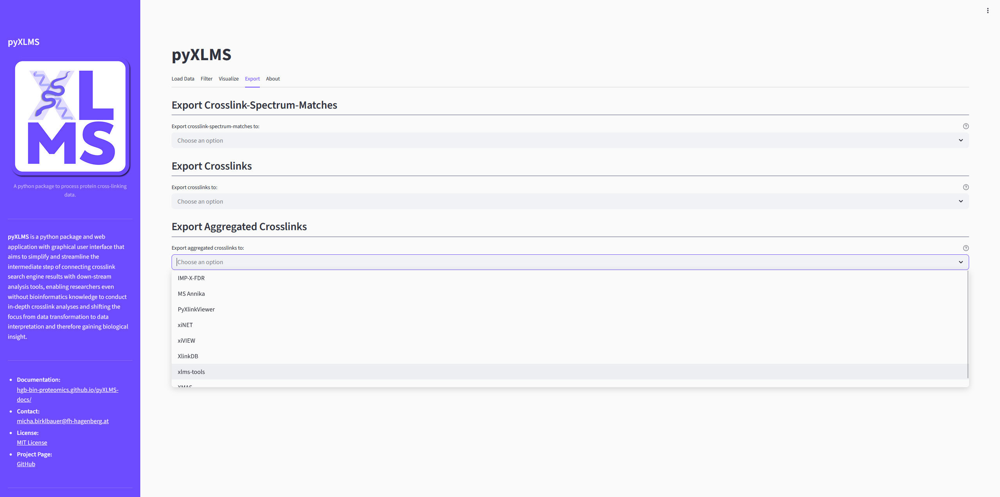
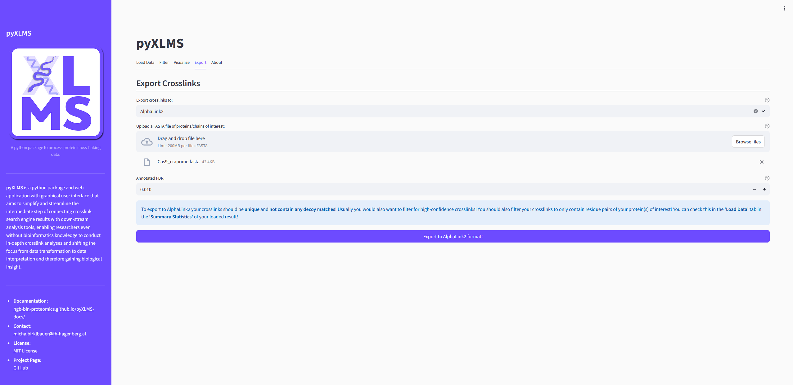
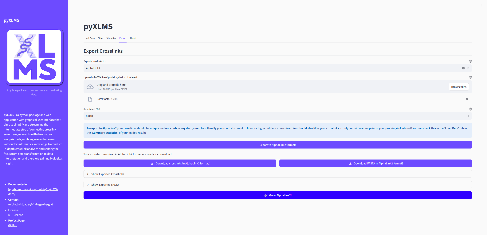

import { Steps } from 'nextra/components'

# Exporting Results

The `Export` tab allows you to export your current selection of CSMs and/or XLs
and/or aggregated XLs to one of the supported down-stream analysis tools or export
formats.

> [!IMPORTANT]
>
> **Please note that all exporters check if the required information to create a successful**
> **export is available at runtime! If key information is missing, an error will be raised!**

## Exporting Your Results

<Steps>

### Select the Down-Stream Analysis Tool/Export Format

Select the down-stream analysis tool or export format that you want to get.

### Verify Your Pre-Processing and Filtering

After selecting an export option a blue callout will appear with recommendations on how your
results should be pre-processed and filtered for the export to work correctly. This is not
only important for the export but subsequent down-stream analysis, e.g. down-stream analysis
tools might not work correctly if your data is not sufficiently pre-processed and filtered,
even if the export worked flawlessly.

> [!WARNING]
>
> **Please note that the exporters do not check which pre-processing steps have been carried out**
> **beforehand! Some down-stream analysis tools might require validated results, some might require**
> **raw results, some might require target matches only, some might require target and decoy matches,**
> **etc. Which filtering steps are applied before export are up to you - the user - and your own**
> **responsibility. Please read the instructions of the down-stream analysis tool you want to use**
> **and get familiar with it and the required data before exporting! The exporter tutorial pages**
> **also give a short overview of recommended pre-processing steps!**

### Supply Any Additionally Required Data

Some exporters need additional data to work, for example a FASTA file or other not yet know meta information.
Please fill in this information.

### Create the Export

Click the `Export to *` button to run the exporter.

### Download the Exported File(s)

If the export finished successfully you will get the option to download the exported
file(s). Sometimes also some additional information about the export is displayed.

### Use Your Exported File(s) with the Selected Down-Stream Analysis Tool

For convenience the web app will also display a button that takes you directly to the
selected down-stream analysis tool!

</Steps>
