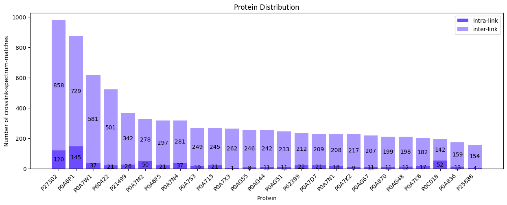
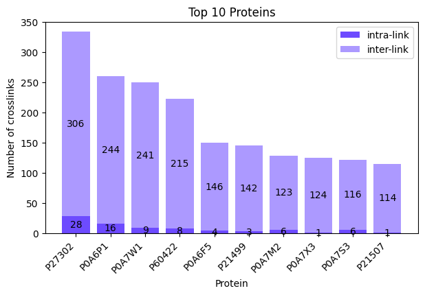

# **Plotting Protein Distribution**


```python
from pyXLMS import __version__

print(f"Installed pyXLMS version: {__version__}")
```
```
    Installed pyXLMS version: 1.3.0
```


```python
from pyXLMS import parser
from pyXLMS import plotting
```

All plotting functionality is available via the `plotting` submodule. We also import the `parser` submodule here for reading result files.


```python
parser_result = parser.read(
    "../_data/20220215_Eclipse_LC6_PepMap50cm-cartridge_mainlib_DSSO_3CV_stepHCD_OT_001.pdResult",
    engine="MS Annika",
    crosslinker="DSS",
)
```
```
    Reading MS Annika CSMs...: 100%|██████████████████████████████████████████████████████████████████████████████████████████████████| 6324/6324 [00:00<00:00, 11030.92it/s]
    Reading MS Annika crosslinks...: 100%|████████████████████████████████████████████████████████████████████████████████████████████| 3025/3025 [00:00<00:00, 22489.35it/s]
```

We read crosslink-spectrum-matches and crosslinks using the [generic parser](https://hgb-bin-proteomics.github.io/pyXLMS/pyXLMS.parser.html#pyXLMS.parser.read) from a single `.pdResult` file.


```python
fig, ax = plotting.plot_protein_distribution(
    parser_result["crosslink-spectrum-matches"],
    figsize=(15.0, 5.0),
    filename_prefix="protein_dist_csms",
)
```


    

    


We can plot the protein distribution for our crosslink-spectrum-matches by passing them as the first argument. **Please note that plotting a protein distribution is only possible if all data have a associated alpha and beta proteins, otherwise the function will raise an exception!** The default figure size is 16 by 9 inches and does not need to be set explicitly, we just used a smaller one here for demonstration purposes. The `filename_prefix` parameter is also optional, if it is given the plot is saved four times: once without the title in `.png` and `.svg` format, and once with the title in `.png` and `.svg` format.


```python
fig, ax = plotting.plot_protein_distribution(
    parser_result["crosslinks"],
    top_n=10,
    title="Top 10 Proteins",
    figsize=(7.0, 4.0),
)
```


    

    


We can do the same plot for our crosslinks by passing them as the first argument instead. This time we also specify `top_n=10` to control the number of proteins in our plot and additionally specify a title via the `title` parameter. Since we did not specify a `filename_prefix` the plot is not saved to disk. There are also other parameters that can be set to tune your plot like `colors`, you can read more about all the possible parameters here: [**docs**](https://hgb-bin-proteomics.github.io/pyXLMS/pyXLMS.plotting.html#pyXLMS.plotting.plot_protein_distribution.plot_protein_distribution).
