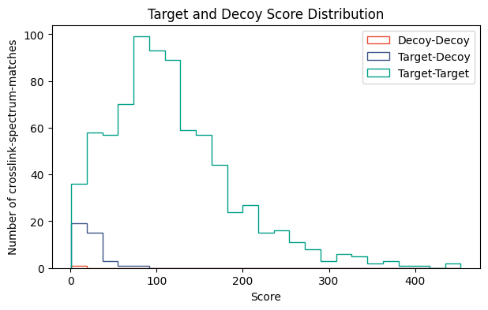
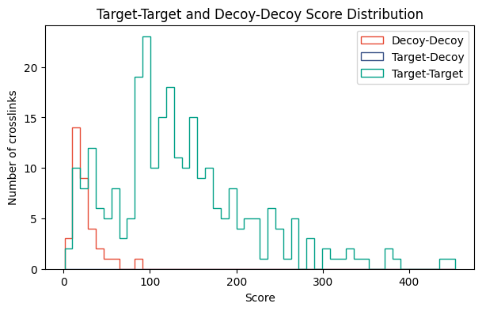

# **Plotting Score Distribution**


```python
from pyXLMS import __version__

print(f"Installed pyXLMS version: {__version__}")
```
```
    Installed pyXLMS version: 1.3.0
```


```python
from pyXLMS import parser
from pyXLMS import plotting
```

All plotting functionality is available via the `plotting` submodule. We also import the `parser` submodule here for reading result files.


```python
parser_result = parser.read(
    "../../data/ms_annika/XLpeplib_Beveridge_QEx-HFX_DSS_R1.pdResult",
    engine="MS Annika",
    crosslinker="DSS",
)
```
```
    Reading MS Annika CSMs...: 100%|████████████████████████████████████████████████████████████████████████████████████████████████████| 826/826 [00:00<00:00, 11471.12it/s]
    Reading MS Annika crosslinks...: 100%|██████████████████████████████████████████████████████████████████████████████████████████████| 300/300 [00:00<00:00, 18169.48it/s]
```

We read crosslink-spectrum-matches and crosslinks using the [generic parser](https://hgb-bin-proteomics.github.io/pyXLMS/pyXLMS.parser.html#pyXLMS.parser.read) from a single `.pdResult` file.


```python
fig, ax = plotting.plot_score_distribution(
    parser_result["crosslink-spectrum-matches"],
    figsize=(7.0, 4.0),
    filename_prefix="score_dist_csms",
)
```


    

    


We can plot the score distribution for our crosslink-spectrum-matches by passing them as the first argument. **Please note that plotting a score distribution is only possible if all data have an associated score and target-decoy labels, otherwise the function will raise an exception!** The default figure size is 16 by 9 inches and does not need to be set explicitly, we just used a smaller one here for demonstration purposes. The `filename_prefix` parameter is also optional, if it is given the plot is saved four times: once without the title in `.png` and `.svg` format, and once with the title in `.png` and `.svg` format.


```python
fig, ax = plotting.plot_score_distribution(
    parser_result["crosslinks"],
    bins=50,
    title="Target-Target and Decoy-Decoy Score Distribution",
    figsize=(7.0, 4.0),
)
```


    

    


We can do the same plot for our crosslinks by passing them as the first argument instead. As a side note, you can see here that MS Annika only uses Decoy-Decoy labels for all decoy crosslinks, not matter if they are Decoy-Decoy or Target-Decoy matches. This time we also specify `bins=50` to control the number of steps in our histogram and additionally specify a title for our plot via the `title` parameter. Since we did not specify a `filename_prefix` the plot is not saved to disk. There are also other parameters that can be set to tune your plot like `density` and `colors`, you can read more about all the possible parameters here: [**docs**](https://hgb-bin-proteomics.github.io/pyXLMS/pyXLMS.plotting.html#pyXLMS.plotting.plot_score_distribution.plot_score_distribution).
